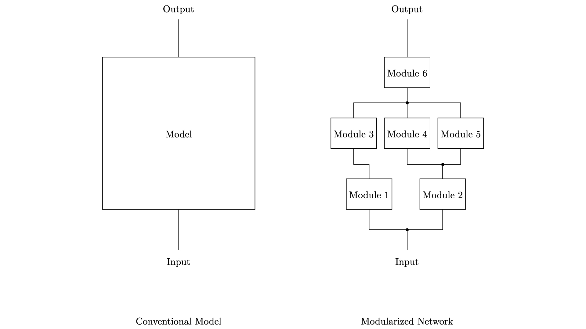

# Impact of modularization on learning behavior and detection rate of Convolutional Neural Networks

## Introduction

Accompanying repository to the [Master's Thesis](./doc/masters_thesis.pdf) "Impact of modularization on learning behavior and detection rate of Convolutional Neural Networks" by the author (Lukas Friedrichsen). Decomposition as a technique is assessed in a Machine Learning context to alleviate certain adverse aspects of conventional Neural Networks for practical applicability such as lacking interpretability of decision making processes or inefficient reuse of once learnt knowledge. The theoretical foundation is supported by different experiments conducted on the CIFAR10 and the [CIFAR100](./CIFAR100.ipynb) datasets (the latter in normal and corrupted version) as well as the animal subset of the [ISLVRC2012](./ILSVRC2012.ipynb) dataset.

This respository contains both the theoretical work as well as the source code of the conducted experiments and the corresponding results. It is the goal of the author to facilitate scientific reproducibility and the provide a basis for similar / further research in this field by open-sourcing this project.

---

## Abstract

The recent rise in task complexity coupled with the inherent shortcomings of neural networks have led to a decline in practical applicability of Deep Learning in many real-world scenarios. To address this issue, we propose modularization as a technique to reduce hardware requirements for training and inference of models and to facilitate knowledge transfer, interpretability of predictions and operability in dynamic environments. In this work, we examine the central question whether it is possible to decompose a conventional neural network to obtain the above properties while at the same time retaining an acceptable degree of performance. We restrict our considerations to the most common forms of modularization and assess the approach on a qualitative basis. We discuss advantages and disadvantages of the technique and provide a heuristic to estimate the error induced by specific forms of decomposition. Using different scenarios from the field of image recognition, we experimentally investigate the impact of modularization on the learning behavior and detection rate of CNNs. Furthermore, we evaluate whether networks composed of multiple modules are less stable than comparable monolithic models on corrupted versions of CIFAR100 and ImageNet. The results indicate that by means of modularization a good compromise between performance and applicability can be achieved for most practical use cases.

<p>&nbsp;</p>



---

## How to run the code?

The source code is written in Python 3.6.9. [Jupyter](https://jupyter.org/) was used as the development enironment. Models were constructed and trained with TensorFlow 2.2.0rc3. To run the notebooks and to avoid version clashes, it is recommended to [create a dedicated ipython kernel](https://ipython.readthedocs.io/en/stable/install/kernel_install.html) in a virtual environment with the aforementioned Python version, e.g. using [pyenv-virtualenv](https://github.com/pyenv/pyenv-virtualenv).

Using pyenv-virtualenv, the process to set up the working environment would be:

1. Create a new virtual environment with Python 3.6.9:
    ```
    pyenv virtualenv 3.6.9 \${ENV_NAME}
    pyenv local \${ENV_NAME}
    ```
2. Install the requirements
    ```
    pip install -r requirements.txt
    ```
3. Locate the location of the ipykernel configuration file
    ```
    jupyter kernelspec list
    ```
4. Make sure that the Python version used is set to that of the virtual environment, i.e.
    ```
    "\${PYENV_PATH}/versions/3.6.9/envs/\${ENV_NAME}/bin/python"
    ```
5. Set the PYTHONPATH of the kernel to the virtual environment, i.e.
    ```
    "env": {
        "PYTHONPATH": "\${PYENV_PATH}/versions/\${ENV_NAME}/lib/python3.6/site-packages/"
    }
    ```
6. Afterwards, Jupyter can be launched from within the virtual environment, e.g. via
    ```
    jupyter-lab
    ```

Regarding the datasets employed in the experiments, CIFAR10 and CIFAR100 are publicly available, both in their normal and corrupted variants. The former can be downloaded directly from within TensorFlow, the latter can be found [here](https://github.com/hendrycks/robustness). As for the ILSVRC 2012 dataset, the code to extract the animal subset is included in the top section of the respective notebook. The original dataset, however, is not publicly available to the best of the authors knowledge; access can be requested via the [ImageNet download page](http://www.image-net.org/download-images).